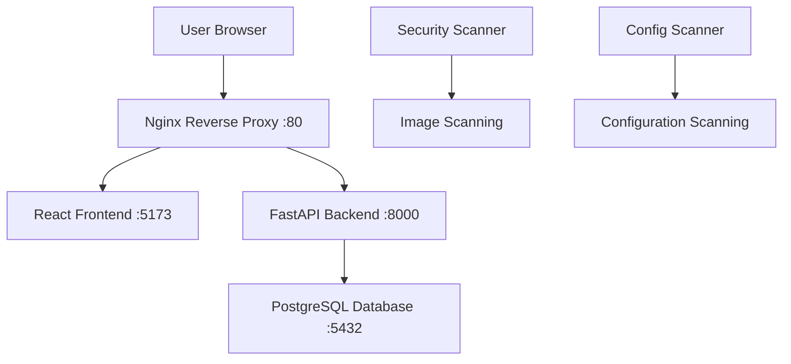

# FarLab Inventory Application

[](https://www.docker.com/)
[](https://fastapi.tiangolo.com/)
[](https://reactjs.org/)
[](https://nginx.org/)
[](https://www.postgresql.org/)

A modern, containerized inventory management system built with FastAPI backend, React frontend, PostgreSQL database, and Nginx reverse proxy. Features include user authentication, JWT tokens, email notifications, automated scheduling, and comprehensive API documentation.

> **🔒 Security Notice**: This application uses a secure secrets management system. All sensitive data (passwords, API keys, tokens) are stored in encrypted files outside of version control. Please review the security configuration section before deployment.

## 🏗️ Architecture Overview

The application follows a microservices architecture with the following components:



### Services

- **Frontend**: React + Vite development server with Hot Module Replacement (HMR)
- **Backend**: FastAPI application with JWT authentication and automated scheduling
- **Database**: PostgreSQL 17 with Alpine Linux for optimal performance
- **Reverse Proxy**: Nginx with security headers, rate limiting, and WebSocket support
- **Security**: Trivy vulnerability scanning for containers and configurations

### Key Features

✅ **Containerized Architecture** - Complete Docker Compose setup  
✅ **Development Ready** - Hot reloading for both frontend and backend  
✅ **Production Security** - Nginx with security headers, rate limiting, and secret management  
✅ **API Documentation** - Swagger UI and ReDoc automatically generated  
✅ **Authentication** - JWT-based user authentication with role management  
✅ **Email Notifications** - SMTP integration for user notifications  
✅ **Automated Tasks** - Background scheduler for maintenance tasks  
✅ **Health Checks** - Comprehensive health monitoring for all services  
✅ **Vulnerability Scanning** - Built-in security scanning with Trivy

## 📋 Prerequisites

Before setting up the project, ensure you have the following installed:

- **Docker Engine**: Version 20.10+ ([Install Docker](https://docs.docker.com/get-docker/))
- **Docker Compose**: Version 2.0+ ([Install Docker Compose](https://docs.docker.com/compose/install/))
- **Git**: For cloning the repository
- **Text Editor**: VS Code, Vim, or your preferred editor

### System Requirements

- **OS**: Linux, macOS, or Windows with WSL2
- **RAM**: Minimum 4GB, recommended 8GB+
- **Storage**: At least 2GB free space for containers and images
- **Ports**: Ensure ports 80, 443, 5173, 8000, and 5432 are available

## 🚀 Quick Start

### 1. Clone the Repository

```bash
git clone https://github.com/yourusername/inventory_project.git
cd inventory_project
```

### 2. Configure Secrets

This application uses a secure secrets management system. Before starting:

1. **Create secrets directory**:
   ```bash
   mkdir -p secrets
   ```

2. **Set up configuration files**:
   ```bash
   # Copy example configuration
   cp .env.example .env
   cp secrets/secrets.example.txt secrets/secrets.txt
   ```

3. **Configure your values**:
   - Edit `secrets/secrets.txt` with your actual secrets
   - Edit `.env` with your non-sensitive configuration
   - **Never commit secrets to version control**

### 3. Validate Configuration

```bash
# Test Docker Compose configuration
docker compose config

# Verify secrets directory exists
ls -la secrets/
```

### 4. Build and Start Services

```bash
# Build and start all services in detached mode
docker compose up --build -d

# View logs (optional)
docker compose logs -f
```

### 5. Verify Installation

```bash
# Check service status
docker compose ps

# Test frontend access
curl -s http://localhost/ | head -5

# Test backend API
curl http://localhost/api/health

# Test API documentation
curl -I http://localhost/docs
```

## 🌐 Accessing the Application

### Primary URLs (via Nginx Reverse Proxy)

| Service               | URL                     | Description                |
| --------------------- | ----------------------- | -------------------------- |
| **Main Application**  | http://localhost/       | React frontend application |
| **API Endpoints**     | http://localhost/api/   | FastAPI backend API        |
| **API Documentation** | http://localhost/docs   | Interactive Swagger UI     |
| **Alternative Docs**  | http://localhost/redoc  | ReDoc documentation        |
| **Health Check**      | http://localhost/health | Nginx health status        |

### Direct Service Access (Development Only)

| Service             | URL                    | Description                   |
| ------------------- | ---------------------- | ----------------------------- |
| **Frontend Direct** | http://localhost:5173/ | Direct Vite dev server        |
| **Backend Direct**  | http://localhost:8000/ | Direct FastAPI server         |
| **Database**        | localhost:5432         | PostgreSQL (use local client) |

### Authentication

The application includes JWT-based authentication. Default admin credentials are configured through the secrets management system. See configuration files for setup instructions.

## 🛠️ Development Workflow

### Starting Development

```bash
# Start services with live reloading
docker compose up --build

# Or run in background
docker compose up --build -d
```

### Making Code Changes

The development setup includes volume mounts for hot reloading:

- **Frontend**: Changes in `./farlab-inventory-frontend/` automatically reload
- **Backend**: Changes in `./farlab-inventory-backend/` automatically reload
- **Nginx**: Restart required for config changes: `docker compose restart nginx`

### Common Development Commands

```bash
# View logs for specific service
docker compose logs -f frontend
docker compose logs -f backend
docker compose logs -f nginx

# Execute commands in containers
docker compose exec frontend npm install
docker compose exec backend pip install package-name

# Access container shell
docker compose exec frontend sh
docker compose exec backend bash

# Restart specific service
docker compose restart frontend

# Rebuild specific service
docker compose up --build frontend
```

### Database Operations

```bash
# Access PostgreSQL shell
docker compose exec db psql -U $DB_USER -d $DB_NAME

# Backup database
docker compose exec db pg_dump -U $DB_USER $DB_NAME > backup.sql

# Restore database
cat backup.sql | docker compose exec -T db psql -U $DB_USER -d $DB_NAME
```

## 🔧 Configuration Management

### Configuration Files

- **`.env`**: Non-sensitive environment configuration
- **`secrets/secrets.txt`**: Encrypted sensitive data (not in version control)
- **`nginx.conf`**: Reverse proxy configuration
- **`docker-compose.yml`**: Service orchestration

### Security Best Practices

- All sensitive data is stored in the `secrets/` directory
- Secrets are mounted read-only into containers
- No passwords or keys are stored in environment variables
- Regular security scanning is built into the development workflow

### Nginx Configuration

The Nginx reverse proxy provides:

- **Security headers**: XSS protection, content type sniffing prevention
- **Rate limiting**: API endpoint protection
- **Static asset handling**: Efficient serving of frontend assets
- **SSL/TLS ready**: HTTPS configuration prepared

### Service Dependencies

```yaml
frontend → backend (API calls)
backend → database (data persistence)
nginx → frontend + backend (reverse proxy)
all services → app-network (internal communication)
```

## 🔍 Debugging and Troubleshooting

### Service Health Checks

```bash
# Check all service health
docker compose ps

# Detailed service status
docker compose exec nginx wget -qO- http://localhost/health
docker compose exec backend curl -f http://localhost:8000/health
docker compose exec frontend wget -qO- http://localhost:5173
```

### Network Connectivity Tests

```bash
# Test internal service communication
docker compose exec frontend curl http://backend:8000/health
docker compose exec nginx wget -qO- http://frontend:5173
docker compose exec nginx wget -qO- http://backend:8000/health

# Check network configuration
docker network ls
docker network inspect inventory_project_app-network
```

### Log Analysis

```bash
# View recent logs for all services
docker compose logs --tail=50

# Monitor logs in real-time
docker compose logs -f

# Service-specific logs
docker compose logs frontend --tail=20
docker compose logs backend --tail=20
docker compose logs nginx --tail=20
docker compose logs db --tail=20
```

### Common Issues and Solutions

#### Frontend Not Loading

```bash
# Check if frontend service is running
docker compose ps frontend

# Check frontend logs
docker compose logs frontend

# Restart frontend service
docker compose restart frontend
```

#### API Endpoints Not Working

```bash
# Test backend directly
curl http://localhost:8000/health

# Check nginx proxy configuration
docker compose exec nginx nginx -t
docker compose logs nginx
```

#### Database Connection Issues

```bash
# Check database status
docker compose ps db
docker compose logs db

# Test database connection
docker compose exec backend python -c "from database import engine; print('DB Connected')"
```

#### Vite HMR Not Working (Development only)

# Check Vite dev server is running
docker compose logs frontend

# Restart frontend service
docker compose restart frontend

# Check if development proxy is working
curl http://localhost:5173/api/health

## 🔒 Security and Production

### Security Features

- **Secret Management**: External secret files, not in environment variables
- **Network Isolation**: Internal network for service communication
- **Rate Limiting**: Protection against API abuse
- **Security Headers**: Protection against common attacks
- **Vulnerability Scanning**: Automated security scanning

### Running Security Scans

```bash
# Scan container images
docker compose --profile security up security-scanner

# Scan configuration files
docker compose --profile security up config-scanner

# Scan for exposed secrets
docker compose --profile security up secret-scanner
```

### Production Deployment Considerations

1. **SSL/TLS Setup**:

   ```bash
   # Create SSL certificate directory
   mkdir -p ssl

   # Generate self-signed certificate (development)
   openssl req -x509 -nodes -days 365 -newkey rsa:2048 \
     -keyout ssl/nginx.key -out ssl/nginx.crt
   ```

2. **Environment Hardening**:

   - Remove development ports exposure
   - Enable IP restrictions for admin endpoints
   - Use strong passwords and rotate secrets regularly
   - Configure proper logging and monitoring

3. **Resource Limits**:
   ```yaml
   deploy:
     resources:
       limits:
         memory: 512M
         cpus: "0.5"
   ```

## 🧹 Maintenance Commands

### Regular Maintenance

```bash
# Stop all services
docker compose down

# Stop and remove volumes (⚠️ deletes data)
docker compose down -v

# Update images
docker compose pull
docker compose up --build -d

# Clean up unused resources
docker system prune -f
```

### Complete Reset (⚠️ Nuclear Option)

```bash
# Remove everything Docker-related
docker system prune -a --volumes

# This removes:
# - All stopped containers
# - All unused networks
# - All unused images
# - All unused volumes (including database data!)
```

### Backup and Restore

```bash
# Backup database
mkdir -p backups
docker compose exec db pg_dump -U $DB_USER $DB_NAME > backups/db_$(date +%Y%m%d).sql

# Backup volumes
docker run --rm -v inventory_project_postgres_data:/data -v $(pwd)/backups:/backup ubuntu tar czf /backup/postgres_data_$(date +%Y%m%d).tar.gz -C /data .

# Restore from backup
cat backups/db_YYYYMMDD.sql | docker compose exec -T db psql -U $DB_USER -d $DB_NAME
```

## 🤝 Contributing

1. Fork the repository
2. Create a feature branch: `git checkout -b feature/amazing-feature`
3. Make your changes with tests
4. Commit your changes: `git commit -m 'Add amazing feature'`
5. Push to the branch: `git push origin feature/amazing-feature`
6. Open a Pull Request

### Development Setup for Contributors

```bash
# Clone your fork
git clone https://github.com/yourusername/inventory_project.git
cd inventory_project

# Add upstream remote
git remote add upstream https://github.com/originalowner/inventory_project.git

# Set up development environment
cp .env.example .env
# Create secret files as described above

# Start development environment
docker compose up --build
```

## 📄 License

This project is licensed under the MIT License - see the [LICENSE](LICENSE) file for details.

## 🆘 Support

If you encounter any issues:

1. Check the [troubleshooting section](#-debugging-and-troubleshooting)
2. Review the logs: `docker compose logs`
3. Search existing [GitHub Issues](https://github.com/yourusername/inventory_project/issues)
4. Create a new issue with:
   - Steps to reproduce
   - Error logs
   - Environment details (OS, Docker version)

## 🎯 Roadmap

- [ ] HTTPS/SSL configuration
- [ ] Kubernetes deployment manifests
- [ ] Automated testing pipeline
- [ ] Performance monitoring
- [ ] Multi-tenant support
- [ ] Mobile app integration

---

**Happy Coding! 🚀**
